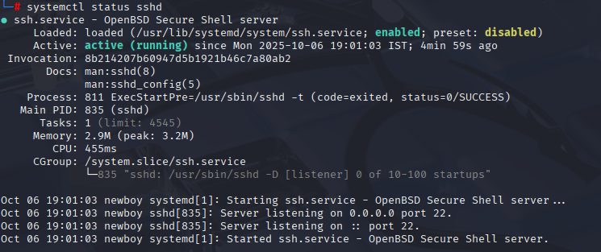
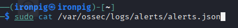
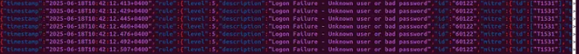
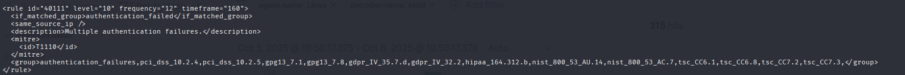
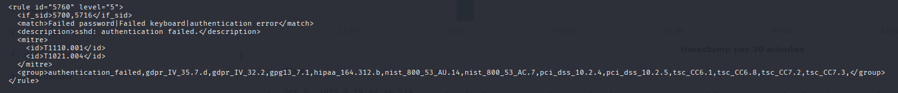
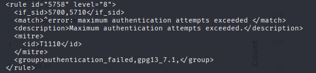
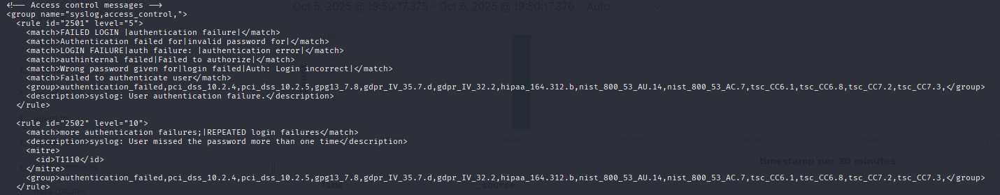
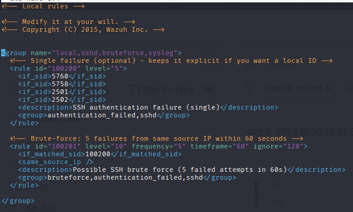

# SSH Brute Force Detection with Wazuh

**Project Type:** Security / Host-based Intrusion Detection  
**Role:** Implementation, Custom Rule Creation, Testing & Validation  
**Tech Stack:**  
- Wazuh (Manager + Agent)  
- Kali Linux (Attacker & Target VMs)  
- OpenSSH (Target)  
- Wazuh Dashboard (Web UI)

---

## 🛠️ Summary

I implemented and validated an SSH brute-force detection workflow using Wazuh. The setup involved:

- Installing the Wazuh manager and dashboard on the attacker Kali VM (acting as the central server).
- Deploying the Wazuh agent on a target Kali machine running `sshd`.
- Performing controlled brute-force attempts from the attacker VM to simulate intrusion.

Although the default Wazuh rule detected the attempts, its frequency did not align with my detection criteria. To address this, I created a custom rule that triggers when SSH authentication failures occur **5 times within 60 seconds**.

✅ The custom rule successfully detected the brute-force attempts and generated an alert in the Wazuh dashboard, confirming the effectiveness of the configuration.

---

# 🚨 SSH Brute Force Detection with Wazuh — Project Steps

## 📋 Prerequisites

- Two Kali Linux virtual machines connected via **Bridged Adapter**:
  - **Attacker VM**: Hosts the Wazuh SIEM (Manager + Dashboard)
  - **Target VM**: Runs the Wazuh Agent and OpenSSH (`sshd`)

---

## 🔍 Detection Workflow

1. **Simulate Brute Force Attack**
   - Using ``hydra`` try to brute force ssh service of the target VM, before that make sure that the ssh service is running on the target.
  
   - Generate multiple failed login attempts to trigger Wazuh rules.
   - Before starting ``hydra`` check sshd service is running using the below command
  

2. **Observe Default Wazuh Alerts**
   - Monitor the Wazuh dashboard for alerts triggered by default SSH rules.
   - Note the frequency and thresholds of these alerts.
     

---

## ⚙️ Custom Rule Creation

3. **Analyze SSH Logs**
   - Review `/var/log/auth.log` on the target VM for failed SSH attempts.
   - Identify log patterns that indicate brute-force behavior.

4. **Create Custom Wazuh Rule**
   - Define a rule in `/var/ossec/etc/rules/local_rules.xml`:
     - Trigger when 5 failed SSH logins occur within 60 seconds.
     - Use `frequency`, `timeframe`, and `group` tags appropriately.

5. **Restart Wazuh Manager**
   - Apply rule changes by restarting the Wazuh manager.
   - Confirm rule loading via logs or dashboard.

---

## ✅ Validation & Testing

6. **Repeat Brute Force Simulation**
   - Launch another round of brute-force attempts.
   - Ensure the custom rule is triggered.

7. **Verify Alert in Dashboard**
   - Check the Wazuh dashboard for alerts generated by the custom rule.
   - Confirm correct classification and timestamping.

8. **Fine-Tune Rule if Needed**
   - Adjust frequency or timeframe based on detection accuracy.
   - Re-test until desired sensitivity is achieved.

---

## 📦 Final Deliverables

- Working Wazuh setup with SSH brute-force detection
- Custom rule file with documentation
- Screenshots or logs of successful alert generation
- Summary report of implementation and validation
- Screenshots or logs of successful alert generation
- Summary report of implementation and validation
